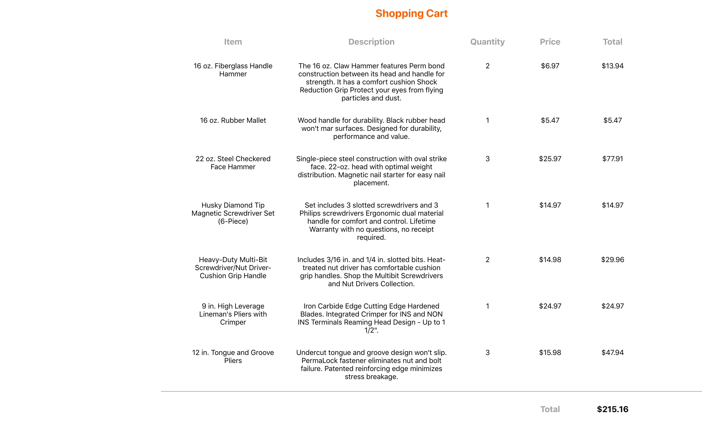

# React JSX Expressions Lab



In this lab you will improve the code in the `App.js` file by using any combination of the following techniques:

* assigning JSX expressions to variables
* creating methods or functions that return JSX expressions

## Instructions

The goal is to reduce the size of the `render` method's return expression (and perhaps the render method itself) by moving some of the JSX expressions into separate blocks of code. You should use descriptive names for your JavaScript variables or functions.

To Get Started:

```bash
git clone https://github.com/om-morehouse/web-programming-labs/tree/master/React-Foundations/React-JSX-Expressions-Lab.git
cd React-JSX-Expressions-Lab
yarn
yarn start
```

Now edit the file `App.js` and manually test to ensure that the code still works.
