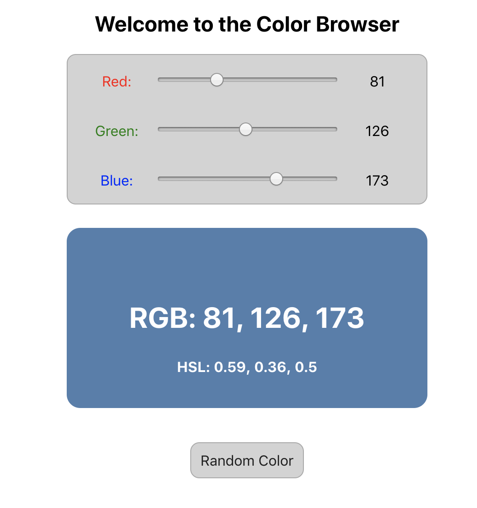

# useState Lab - Color Browser

## Goal

Get some practice with `useState` by refactoring a ColorSlider application to use the `useState` hook.

## Instructions

1. You may use code that you have already written or you may use the code provided in the `color-browser` folder.
2. A live demo is running [here](https://pages.github.homedepot.com/om-labs/React-Color-Browser-Demo/).
3. Refactor the code to use the `useState` hook instead of `setState`.

### Hints

* You should only need to modify the `ColorBrowser` component.
* You will want to convert the `ColorBrowser` from a JavaScript class to a JavaScript function
* You will want to remove all occurrences of `this` (as in `this.state.products` and `this.addProduct.bind(this)`)
